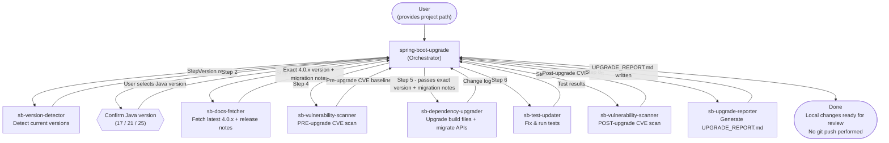

# GitHub Copilot Agents

A collection of custom GitHub Copilot agents for automating complex engineering workflows in VS Code.

---

## Available Agents

### Spring Boot Upgrade Suite

A coordinated set of agents that automates upgrading a Spring Boot project to **version 4.0.x**.

| Agent | Role |
|---|---|
| `spring-boot-upgrade` | **Orchestrator** — entry point; coordinates the full upgrade workflow end-to-end |
| `sb-version-detector` | Scans `pom.xml` / Gradle files and reports all current Spring Boot, Java, and dependency versions |
| `sb-docs-fetcher` | Fetches the latest 4.0.x version from Maven Central, Spring Boot release notes, and ecosystem migration guides |
| `sb-dependency-upgrader` | Upgrades build files, migrates `javax.*` → `jakarta.*`, and fixes removed/renamed APIs |
| `sb-test-updater` | Updates test code for Spring Boot 4.0 compatibility and runs the full test suite |
| `sb-vulnerability-scanner` | Scans dependencies for CVEs (run before and after upgrade for comparison) |
| `sb-upgrade-reporter` | Produces a comprehensive `UPGRADE_REPORT.md` in the project root |

---

## Architecture — Spring Boot Upgrade



### Key design decisions

- **No hardcoded versions** — the latest `4.0.x` patch is resolved dynamically at runtime from Maven Central.
- **User confirms Java version** — the only manual decision in the workflow; Java 17, 21, or 25.
- **No git operations** — all changes are left uncommitted so you can review the diff before pushing.
- **Files scoped to project root** — no agent reads from or writes to any path outside the target project directory.
- **Sub-agents are not user-invocable** — only `spring-boot-upgrade` appears in the agent picker; the others run only as sub-agents.

---

## How to Use in a Project

### Option A — Add to your existing repo (recommended)

Copy the `.github/agents/` folder into your project repository:

```bash
cp -r .github/agents/ /path/to/your-project/.github/agents/
```

VS Code automatically discovers all `.agent.md` files in `.github/agents/` when you open the project.

### Option B — Open alongside your project as a multi-root workspace

1. Open your project in VS Code.
2. Go to **File → Add Folder to Workspace** and add this repo.
3. VS Code will discover the agents from this folder alongside your project.

### Option C — Reference via `chat.agentFilesLocations`

Add to your project's `.vscode/settings.json`:

```json
{
  "chat.agentFilesLocations": [
    "/path/to/gh-copilot-agents/.github/agents"
  ]
}
```

> **Note:** Option C uses an absolute path, so it won't work across machines without adjustment.

---

## Running the Spring Boot Upgrade

1. Open GitHub Copilot Chat in VS Code (`⌃⌘I`).
2. Select the **`Spring Boot Upgrade to 4.0.x`** agent from the agent picker.
3. Provide the path to your project root when prompted, e.g.:

   ```
   /Users/you/projects/my-spring-app
   ```

4. The agent will detect your current versions, ask you to confirm the target Java version, and then run the full upgrade workflow automatically.
5. When complete, review the changes in your project's git diff and the generated `UPGRADE_REPORT.md` before committing and pushing.

---

## Requirements

- VS Code with the GitHub Copilot extension
- The target project must use **Maven** (`pom.xml`) or **Gradle** (`build.gradle` / `build.gradle.kts`)
- Internet access (for Maven Central version lookup and Spring documentation fetching)
